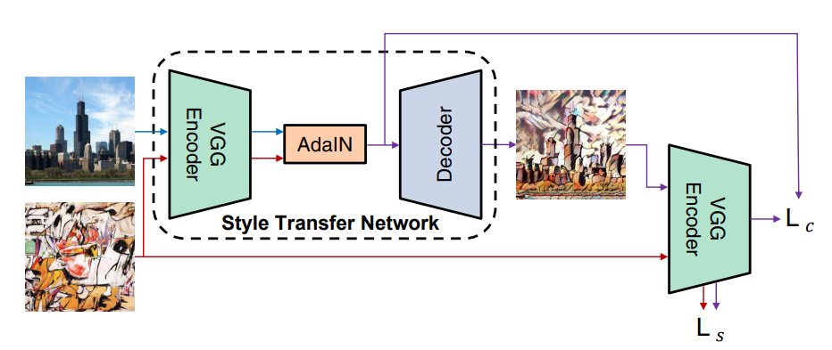

# AdaIN-style (PyTorch)

This repository contains a PyTorch implementation of **Adaptive Instance Normalization (AdaIN)** for arbitrary style transfer.

**Paper:** [Arbitrary Style Transfer in Real-time with Adaptive Instance Normalization (ICCV 2017)](https://openaccess.thecvf.com/content_ICCV_2017/papers/Huang_Arbitrary_Style_Transfer_ICCV_2017_paper.pdf)  
**Original Source Code:** [GitHub - xunhuang1995/AdaIN-style](https://github.com/xunhuang1995/AdaIN-style)

---

## Requirements

Install dependencies from `requirements.txt`:

```bash
pip install -r requirements.txt
```

## Pretrained Model
Download the pretrained model from Google Drive: [pretrain_weight](https://drive.google.com/file/d/1nCgYgbQh0bdi7SZq7-2CgKttkv3bbUoK/view?usp=sharing)

Place it in the weights/ directory or any folder you prefer.

## Usage (Inference)
Run the style transfer on a content and style image:

```bash
python test.py \
    -c /path/to/content.jpg \
    -s /path/to/style.jpg \
    -o /path/to/output.jpg \
    -a 1.0 \
    -g 0 \
    -m /path/to/model.pth
```

## Architecture
<p align='center'>
  
</p>

## Datasets

We use two datasets:

1. **Content images**: [COCO 2017 Dataset](https://www.kaggle.com/datasets/awsaf49/coco-2017-dataset)  
   - We use the `train2017` images as content images.  
   - Images are randomly cropped and resized to 512x512.

2. **Style images**: [Best Artworks of All Time](https://www.kaggle.com/datasets/ikarus777/best-artworks-of-all-time)  
   - Each folder contains images by a single artist.  
   - Images are randomly cropped and resized to 512x512.

The dataset class also automatically saves the cropped/resized images into:  
- `content_resized/`  
- `style_resized/`

---

## Example
<p float="center">
  
  
  
</p>
<p float="center">
  
  
  
</p>
<p float="center">
  
  
  
</p>
<p float="center">
  
  
  
</p>

## Demo
You can run a small demo by:
```bash
python app.py
```
Then open your browser at: http://localhost:8000


## Citation
```bash
@inproceedings{huang2017adain,
  title={Arbitrary Style Transfer in Real-time with Adaptive Instance Normalization},
  author={Huang, Xun and Belongie, Serge},
  booktitle={ICCV},
  year={2017}
}
```